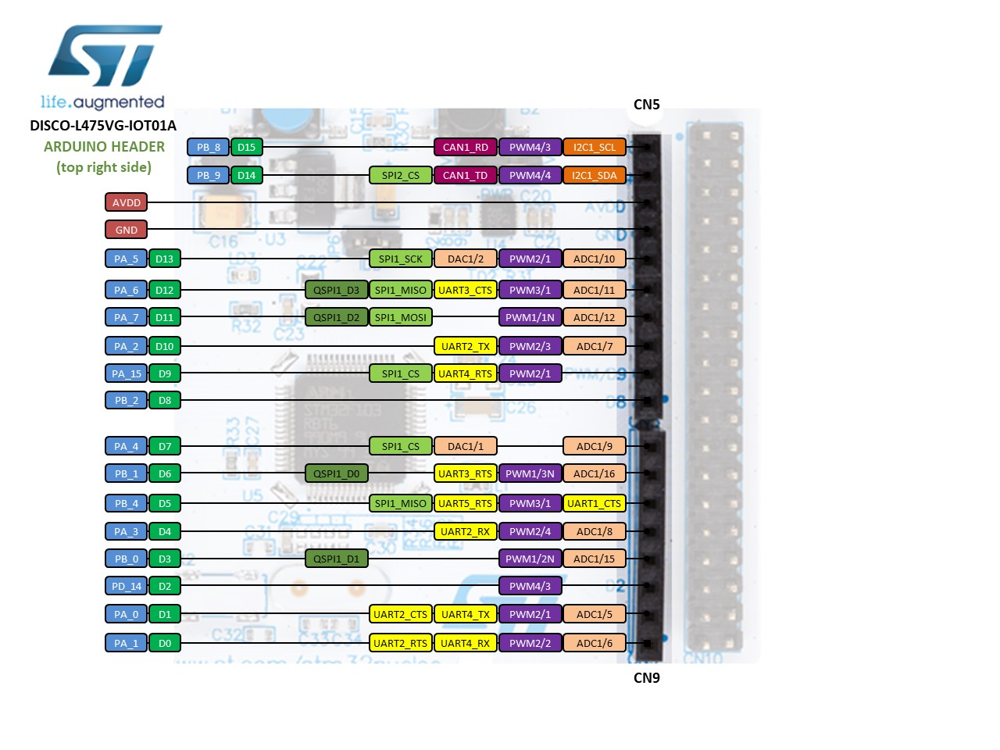
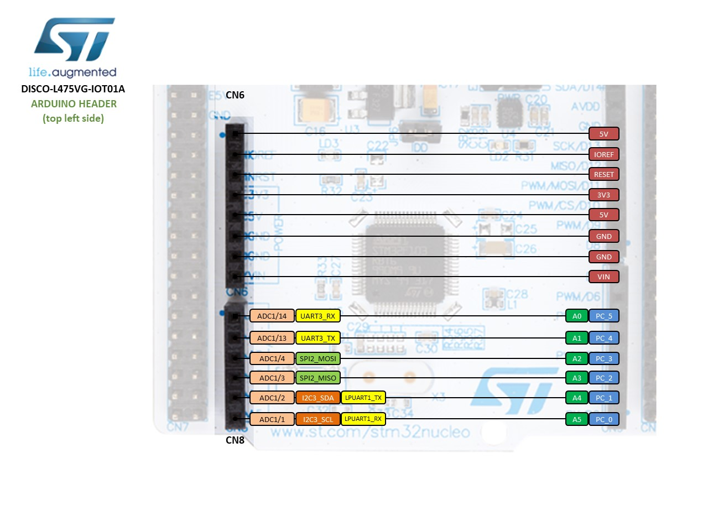
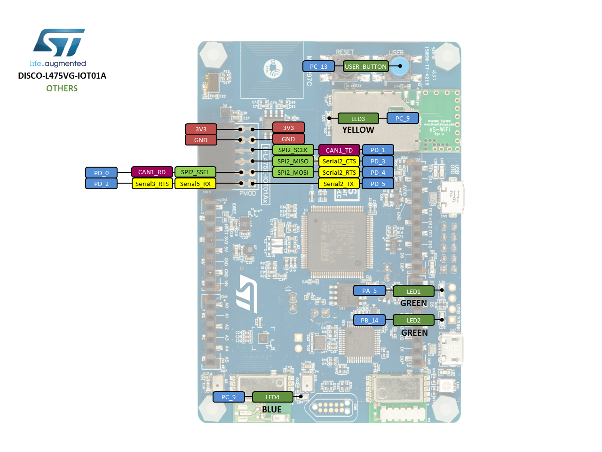

# Overview

The B-L475E-IOT01A Discovery kit for IoT node allows users to develop applications with direct connection to cloud servers.
Board photo for B-L475E-IOT01AThe Discovery kit enables a wide diversity of applications by exploiting low-power
communication, multiway sensing and Arm Cortex-M4 core-based STM32L4 Series features. The support for Arduino Uno V3 and
PMOD connectivity provides unlimited expansion capabilities with a large choice of specialized add-on boards.

# Board pinout

## Pins Legend

# Getting started

- [Getting started guide](um2052.pdf)

## ST-LINK driver installation and firmware upgrade

1. Download the latest [ST-LINK driver](https://www.st.com/en/development-tools/stsw-link009.html).
2. Extract the archive and run `dpinst_amd64.exe`. Follow the displayed instructions.
3. Download the latest [ST-LINK firmware upgrade](https://www.st.com/en/development-tools/stsw-link007.html).
4. Extract the archive and run the STLinkUpgrade.exe program.
5. Connect the board to your PC using a USB cable and wait until the USB enumeration is completed.
6. In the **ST-Link Upgrade** program, press the **Device Connect** button.
7. When the ST-LINK driver is correctly installed, the current ST-LINK version is displayed.
8. Press the **Yes >>>>** button to start the firmware upgrade process.

# Technical reference

- [STM32L475VG microcontroller](https://www.st.com/en/microcontrollers-microprocessors/stm32l475vg.html)
- [B-L475E-IOT01A board](hhttps://www.st.com/en/evaluation-tools/32l496gdiscovery.html)
- [User manual](DM00347848.pdf)
- [Data brief](b-l475e-iot01a.pdf)
